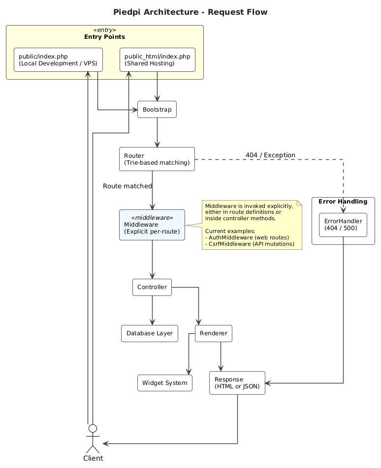

# Piedpi

## Why This Project Exists

Piedpi was created as a lightweight, educational, and production-conscious PHP codebase that demonstrates how a modern web application can be built **without relying on large frameworks**, while still preserving good engineering principles.

Many MVPs and internal tools start small but fail to scale cleanly because they are either:

* Over-engineered from day one using heavy frameworks
* Under-engineered with no clear architecture or boundaries

Piedpi sits intentionally in the middle.

It is designed to:

* Be easy to understand from the first read
* Encourage correct architectural habits
* Scale gradually from MVP to a more serious system
* Teach how common framework features actually work internally

This repository is **not a framework**.
It is a **reference architecture and learning-oriented codebase**.

---

## Design Philosophy

Piedpi follows a few core ideas:

1. Explicit is better than implicit
2. Simple control flow beats hidden magic
3. Files and directories should explain themselves
4. Production safety matters even for prototypes
5. Core concepts should be readable without IDE assistance

The code favors clarity over cleverness, and correctness over shortcuts.

---

## High-Level Architecture

The application follows a layered structure with clear separation of concerns:

* **public/** and **public_html/** – Web server entry points (see Deployment notes below)
* **app/** – Core application logic, controllers, and presentation
* **config/** – Environment-driven configuration
* **routes/** – Route definitions
* **storage/** – Runtime data (cache, logs)
* **db/** – Database schema and assets

Each component has a single responsibility and minimal coupling.

---

## Architecture Diagram



> **Source:** `docs/architecture/piedpi-architecture.puml` (generated with PlantUML)

See the Request Lifecycle section for the detailed step-by-step flow.

---

## Middleware

Piedpi uses an **explicit middleware approach** instead of an automatic pipeline. Middleware is applied manually where needed, keeping control flow visible and simple.

### Usage Patterns

**1. From routes (recommended for most cases)**

```php
$router->post('/api/items', function () {
    \App\Core\Middleware\CsrfMiddleware::handle();
    (new ItemController())->store();
});
```

**2. From inside a controller method**

```php
public function store(): JsonResponse
{
    \App\Core\Middleware\CsrfMiddleware::handle();
    // ... controller logic
}
```

### Examples in this project

- `AuthMiddleware` — protects web routes (e.g. `/admin/dashboard`)
- `CsrfMiddleware` — protects state-changing API endpoints (`POST`, `PUT`, `DELETE` on `/api/items`)

Both are located in `app/Core/Middleware/`.

This design follows the project's core principle: **explicit is better than implicit**.

---

## Project Directory Structure

```
piedpi/
├── app/
│   ├── Controllers/     # Request handlers
│   ├── Core/            # Router, Renderer, ErrorHandler, DB, etc.
│   └── Views/           # Presentation templates
├── config/              # app.php, database.php
├── db/                  # SQL schema files
├── dist/                # Static HTML assets (served via DistController)
├── public/              # Local development entry point
├── public_html/         # Shared hosting entry point
├── routes/              # web.php, api.php
├── storage/
│   ├── cache/           # Compiled template cache
│   └── logs/            # Application logs
├── tests/               # Test suite and runner
├── bootstrap.php        # Application bootstrap and autoloading
├── Dockerfile
├── .env.example
└── README.md
```

---

## Branches

This repository maintains dedicated branches for focused development:

* **main** – Stable full-stack application with integrated frontend and backend.
* **frontend-services** – Frontend-focused services and UI components.
* **backend-services** – Backend services, APIs, and server-side logic.

Use `git checkout <branch>` to switch between branches as needed.

---

## Request Lifecycle

A request flows through the system in the following order:

1. Web server routes requests to `public/index.php` (local development and VPS) or `public_html/index.php` (shared hosting)
2. `bootstrap.php` initializes environment and autoloading
3. Environment variables are loaded from `.env`
4. Router matches HTTP method and path
5. The matched controller method is executed
6. Controllers return explicit response objects
7. Renderer streams output or JSON is sent
8. Custom error routes are invoked if needed (404 / 500)

There is no hidden middleware stack or container magic.
The flow is explicit, linear, and debuggable.

---

## Core Components

### Router

The Router uses a **Trie-based structure** to match routes efficiently.

Features:

* Static routes (`/`)
* Dynamic parameters (`/users/:id`)
* Method-based dispatching
* Explicit route definitions
* Router-level 404 and 500 handlers

Error handling is treated as a **first-class routing concern**, not a side effect.

---

### Renderer

The Renderer is responsible for output streaming and view composition.

Key ideas:

* Output is streamed in chunks
* Views are included explicitly
* No template engine abstraction
* Predictable rendering order
* Optional static asset serving with gzip support

This avoids buffering pitfalls and makes rendering behavior easy to reason about.

---

### Widget System

Widgets are small, reusable UI helpers implemented as plain PHP classes.

They:

* Generate semantic HTML structures
* Support nested and mixed content safely
* Avoid stateful UI logic
* Keep presentation logic close to markup

Widgets enable progressive HTML composition without introducing a template engine.

---

### Error Handling

Error handling is explicit and centralized at the Router level.

Responsibilities:

* Custom 404 (Not Found) routing
* Custom 500 (Internal Server Error) routing
* Exception-safe handler execution
* Environment-aware diagnostics

Runtime failures and HTTP routing errors are intentionally separated to avoid leaking internal details.

---

### Database Layer

Piedpi includes a **minimal and safe database foundation**, not an ORM.

Components:

* `config/database.php` — environment-based configuration
* `Connection` — centralized PDO connection factory
* `DB` — static, safe PDO facade
* `DatabaseException` — boundary exception for all DB failures

Design goals:

* No hidden state
* No query builder
* No magic models
* Explicit SQL ownership

This layer provides a clean upgrade path without locking the architecture.

---

## Configuration

Configuration files live in `config/` and are plain PHP arrays.

* `app.php` controls environment and debug behavior
* `database.php` defines database connection settings

Environment variables are loaded via `.env` during bootstrap, keeping secrets out of version control and avoiding `getenv()` pitfalls.

---

## Running the Project

Requirements:

* PHP 8.1 or higher
* PDO extension for database usage

Start the development server:

```bash
php -S localhost:8888 -t public
```

Then open:

```
http://localhost:8888
```

For local development always use the `public/` directory. When deploying to shared hosting platforms that require the document root to be named `public_html`, use the `public_html/` directory instead (the contents are identical).
---

## Testing

Piedpi includes a **minimal, dependency-free testing setup**.

Goals:

* Demonstrate how testing works internally
* Keep execution flow explicit
* Avoid framework-level magic

### Test Structure

```
/tests
  ├── bootstrap.php
  ├── run.php
  ├── RouterTest.php
  ├── WidgetTest.php
  └── DatabaseTest.php
```

* `bootstrap.php` initializes the test environment
* `*Test.php` files group related tests
* `run.php` discovers and executes tests

Assertions are implemented as simple functions that throw exceptions on failure.

### Running Tests

```bash
php tests/run.php
```

Skipping tests:

```bash
php tests/run.php --skip=database
```

The test runner is intentionally minimal:

* No external framework
* No annotations
* Fully readable in a single file

---

## Intended Use Cases

Piedpi is suitable for:

* MVPs and prototypes
* Internal dashboards
* Learning PHP architecture
* Teaching material or interviews
* Systems that may later migrate to full frameworks

It is not intended to replace Laravel or Symfony, but to **explain how they work internally**.

---

## Scalability Path

As a project grows, Piedpi can evolve by adding:

* Extended database helpers
* Service layer abstractions
* Authentication & authorization
* Request / response objects
* Caching and queues

The existing structure supports these additions without major refactoring.

---

## Philosophy on Growth

Start small, but start clean.

Piedpi is built on the belief that good architecture does not require complexity — only discipline.

---

## License

This project is released under the MIT License.
